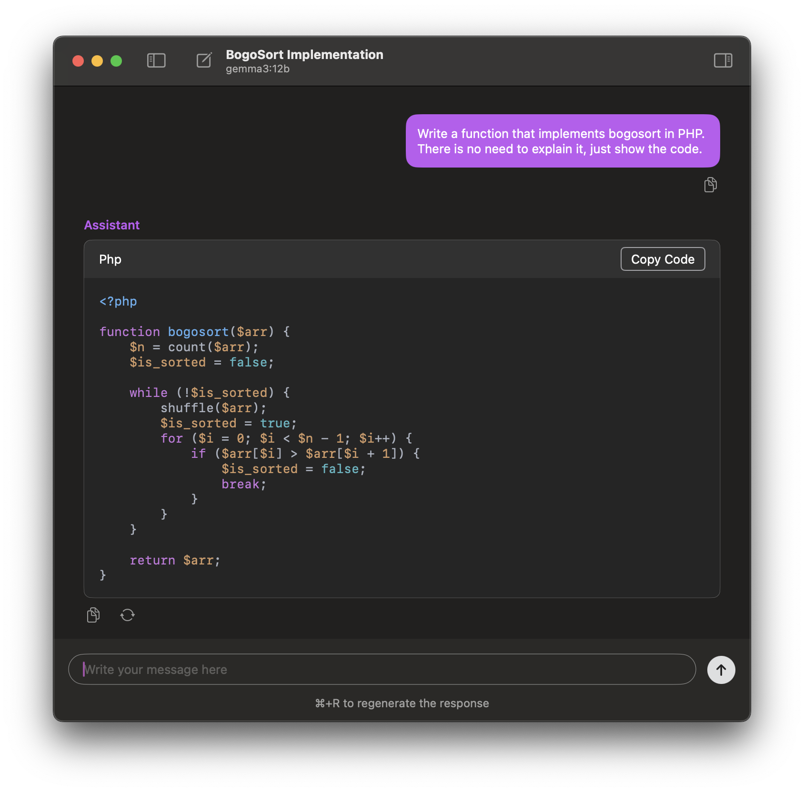
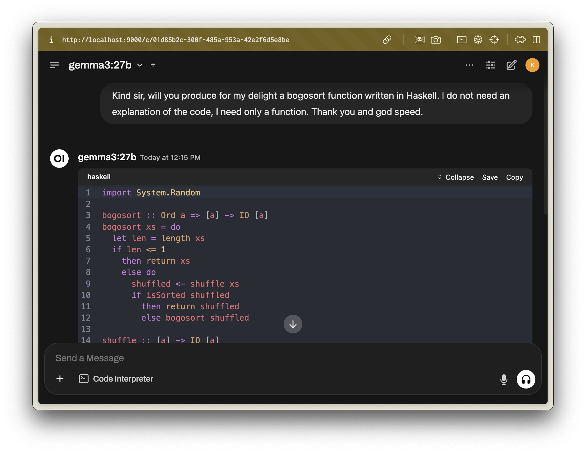

# My Local LLM Setup

## 1. Install ollama

[ollama](https://ollama.com/) is a simple way to download open source models and to make the available through a local server on your laptop. I install almost everything through [homebrew](https://brew.sh/) these days and everything in this guide is no different. So let's start by installing `ollama`.

```bash
brew install ollama
```

## 2. Start ollama and download a model

There are a lot of [models](https://ollama.com/search) available. Some are enormous and aren't suitable for running on a laptop. Others are so tiny that they are only good for toy use cases. I find that the [gemma3](https://ollama.com/library/gemma3) model is a good choice for chat on a laptop. In fact, this is why Google released it. It's a model that is intended to run effectively on a single GPU.

But before we download a model, we need to start the `ollama` server. This command will start a server so open it in a background terminal window.

```bash
ollama serve
```

Now we can download the model.

```bash
ollama pull gemma3:12b
```

This is going to take a while as the model is about 8.1GB. It will display a progress bar as it downloads. I should also note that if you want to see the models that you have downloaded, you can use the `ollama list` command. There are also commands for removing models, which is useful since they are quite large. Since my laptop is an M1 Max with 64G of unified memory, [gemma3:27b](https://ollama.com/library/gemma3:27b) is also usable and I have it installed and use it from time to time if I need to warm up my lap.

## 3. Running a model

We will install a proper GUI next that will make it easy to chat with the model. But do realize that you can also chat in the terminal by simply running the following command.

```bash
ollama run gemma3:12b
```

## 4. Install Ollamac

I've tried a few different UIs. There is a nice web client called [Open WebUI](https://openwebui.com/). It's very good and it includes a lot of features. I've added a section below describing how I run it in docker. I like a simple native app so I use [Ollamac](https://github.com/kevinhermawan/Ollamac). It looks like this,



As you might have guess, I also install this through homebrew.

```bash
brew install --cask ollamac
```

That will install it in `/Applications`. If I remember correctly, it checks for a local ollama server, so it should be ready to go when you start it. If it isn't, for some reason, your ollama server is running locally at `http://localhost:11434`. Pro-tip: That ollama server also has a nice set of APIs you can use for your own local coding projects.

## 5. Install Open WebUI (optional)

I like using Ollamac mostly because it's a native app and switching to it is easy. However, the web UI Open WebUI has a better and more feature rich experience than Ollamac. If you want to give that a try, here's a docker command as a starting point. I run this docker command in the foreground just because I already have a tab in kitty dedicated to local tools. Adjust the commmand to your own tastes.

```bash
docker run -ti --rm -p 9000:8080 \
	-e WEBUI_AUTH=False \
	--add-host=host.docker.internal:host-gateway \
	-v open-webui:/app/backend/data \
	--name open-webui \
	ghcr.io/open-webui/open-webui:main
```

If you use this command, it will start a local server at `http://localhost:9000`. Here's what it looks like,



That's it! I like this little setup. It's simple and it works well.
